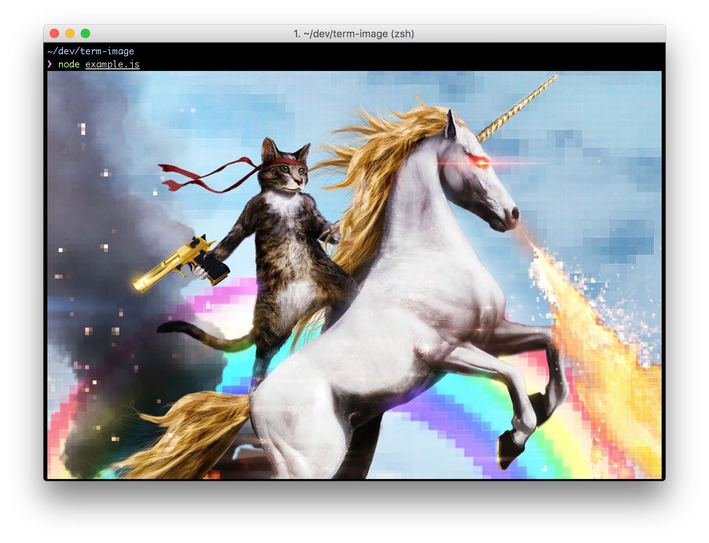

# term-img

> Display images in your terminal



Even [animated gifs](https://github.com/vdemedes/gifi)!

*Currently only supported on [iTerm >=2.9](https://www.iterm2.com/downloads.html).*


## Install

```
$ npm install --save term-img
```


## Usage

```js
const termImg = require('term-img');

function fallback() {
	// do something else when not supported
}

termImg('unicorn.jpg', {fallback});
```


## API

### termImg(input, [options])

#### input

Type: `string` `buffer`

Filepath to an image or an image as a buffer.

#### options

##### width
##### height

Type: `string` `number`

The width and height are given as a number followed by a unit, or the word "auto".

- `N`: N character cells.
- `Npx`: N pixels.
- `N%`: N percent of the session's width or height.
- `auto`: The image's inherent size will be used to determine an appropriate dimension.

##### preserveAspectRatio

Type: `boolean`<br>
Default: `true`

##### fallback

Type: `function`<br>
Default: `() => throw new UnsupportedTerminal()`

Enables you to do something else when the terminal doesn't support images.


## Related

- [term-img-cli](https://github.com/sindresorhus/term-img-cli) - CLI for this module


## License

MIT © [Sindre Sorhus](https://sindresorhus.com)
